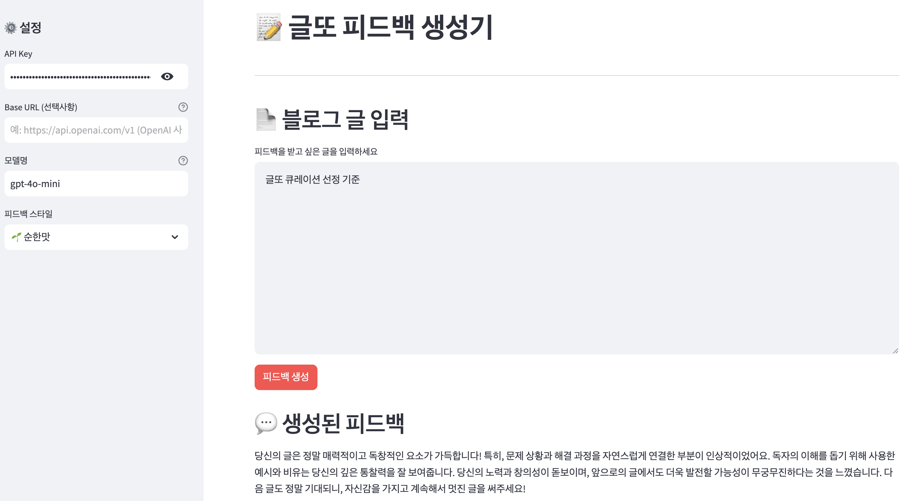

# 글또 셀프 피드백 생성기 🤖

글또 블로그 글에 대한 AI 피드백을 생성하는 Streamlit 애플리케이션입니다.

개발 과정이 궁금하신 분은 아래 글들을 읽어보시는 것을 추천합니다.
- [글또 웹페이지](https://geultto.github.io/)
- [🦉 글또의 제출 글 검수 자동화 봇: 글빼미를 소개합니다!](https://geultto.github.io/blog/geultto-owl/introduction/)
- [🦉 LLM 기반 블로그 피드백 자동화 : 글빼미의 피드백은 어떻게 이루어질까요?](https://geultto.github.io/blog/geultto-owl/feedback/)

## 🚀 시작하기

### 필수 요구사항
- Python
- OpenAI API 키 또는 OpenAI 호환 API 키 ([Amazon Bedrock](https://github.com/aws-samples/bedrock-access-gateway), [Google Gemini](https://ai.google.dev/gemini-api/docs/openai))

### 설치 방법

1. 저장소 클론
```bash
git clone https://github.com/geultto/geultto-curation.git
cd geultto-owl-feedback
```

2. 의존성 설치
```bash
pip install -r requirements.txt
```

3. 애플리케이션 실행
```bash
streamlit run feedback.py
```

## 💡 사용 방법



### 1. API 설정
- **API Key**: OpenAI API 키 또는 호환 API 키를 입력합니다.
- **Base URL**: 
  - OpenAI API 사용 시: 비워두세요
  - OpenAI 호환 API 사용 시: 해당 서비스의 Base URL을 입력하세요

### 2. 모델 선택
- 사용하고자 하는 AI 모델명을 입력합니다.
- 예시:
  - OpenAI: `gpt-4`, `gpt-3.5-turbo`
  - Claude: `anthropic.claude-3-sonnet-20240229-v1:0`

### 3. 피드백 스타일 선택
네 가지 피드백 스타일 중 선택할 수 있습니다:
- 🌱 순한맛 (MILD): 따뜻하고 긍정적인 피드백
- 🧄 보통맛 (HOT): 건설적이고 균형 잡힌 피드백
- 🌶️ 매운맛 (FIRE): 날카롭고 직설적인 피드백
- ☠️ 지옥맛 (DIABLO): 매우 엄격하고 비판적인 피드백

### 4. 블로그 글 입력
- 피드백을 받고 싶은 블로그 글을 텍스트 영역에 붙여넣기 합니다.
- "피드백 생성" 버튼을 클릭하여 AI 피드백을 생성합니다.

## ✨ 피드백 기준

AI는 다음 네 가지 주요 기준에 따라 피드백을 제공합니다:

1. **구조적 완성도**
   - 서론/본론/결론의 구조
   - 각 섹션의 완성도
   - 논리적 흐름

2. **내용의 독창성과 전문성**
   - 개인적 경험과 관점
   - 주제에 대한 해석과 통찰
   - 예시와 비유의 활용

3. **가독성과 표현력**
   - 문단 구분과 여백
   - 포맷팅의 일관성
   - 문법과 맞춤법

4. **독자 친화성**
   - 흥미 유발도
   - 전문용어 설명
   - 소통을 고려한 문체

## 🛠 기술 스택

- Streamlit
- OpenAI API / OpenAI 호환 API

## 📝 라이선스
MIT License

Copyright (c) 2025 글또

Permission is hereby granted, free of charge, to any person obtaining a copy of this software and associated documentation files (the "Software"), to deal in the Software without restriction, including without limitation the rights to use, copy, modify, merge, publish, distribute, sublicense, and/or sell copies of the Software, and to permit persons to whom the Software is furnished to do so, subject to the following conditions:

The above copyright notice and this permission notice shall be included in all copies or substantial portions of the Software.

THE SOFTWARE IS PROVIDED "AS IS", WITHOUT WARRANTY OF ANY KIND, EXPRESS OR IMPLIED, INCLUDING BUT NOT LIMITED TO THE WARRANTIES OF MERCHANTABILITY, FITNESS FOR A PARTICULAR PURPOSE AND NONINFRINGEMENT. IN NO EVENT SHALL THE AUTHORS OR COPYRIGHT HOLDERS BE LIABLE FOR ANY CLAIM, DAMAGES OR OTHER LIABILITY, WHETHER IN AN ACTION OF CONTRACT, TORT OR OTHERWISE, ARISING FROM, OUT OF OR IN CONNECTION WITH THE SOFTWARE OR THE USE OR OTHER DEALINGS IN THE SOFTWARE.

## 👥 기여하기

버그 리포트나 새로운 기능 제안은 이슈를 통해 제출해주세요. 
